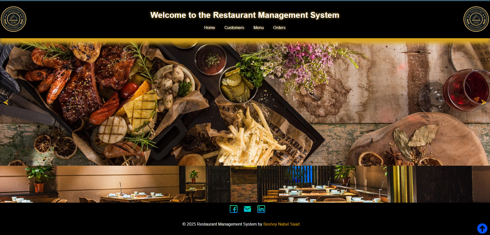
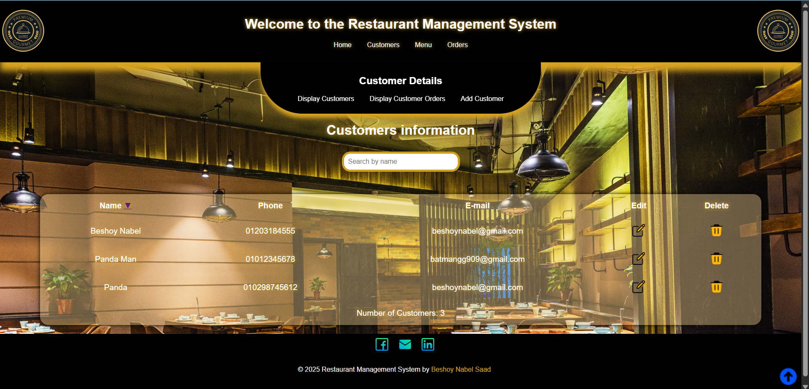
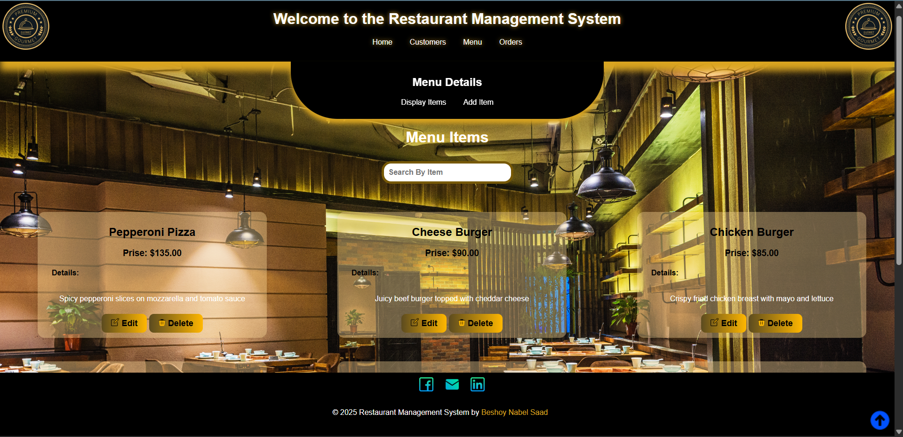
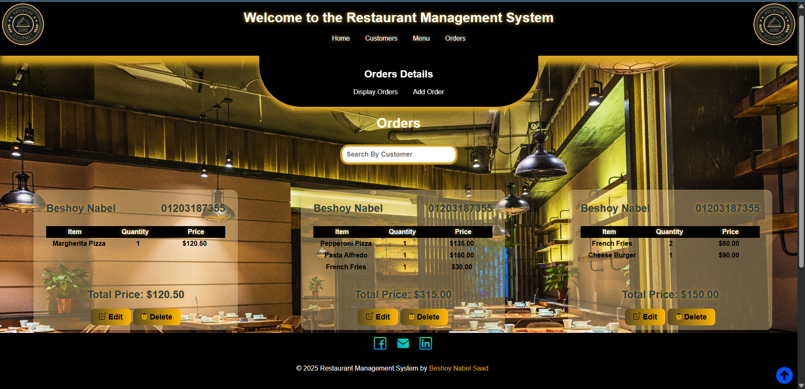

# 🍽️ Restaurant Management System



<p align="center">
  
  
  
  
</p>

<p align="center">
  A complete **Restaurant Management System** built with **Django** and **PostgreSQL**,  
  designed to manage **customers**, **menu items**, and **orders** efficiently.
</p>

---

## 📑 Table of Contents
- [✨ Overview](#-overview)
- [🚀 Features](#-features)
- [🛠️ Tech Stack](#️-tech-stack)
- [⚙️ Installation & Setup](#️-installation--setup)
- [📸 Screenshots](#-screenshots--demo)
- [📂 Project Structure](#-project-structure)
- [👨‍💻 Author](#-author)
- [📜 License](#-license)

---

## ✨ Overview
The **Restaurant Management System** is a full-stack Django-based web application designed to simplify restaurant operations.  
It provides an intuitive interface to manage:
- Customers
- Menu items
- Orders

With seamless integration of **PostgreSQL** via **pgAdmin**, the system ensures data accuracy and fast operations.

---

## 🚀 Features

### 🧑‍🤝‍🧑 **Customers App**
- Add new customers.
- View a list of all customers.
- Edit customer details.
- Delete customers.
- Track the total number of orders per customer.

### 📜 **Menu App**
- Add new menu items.
- View the complete menu.
- Edit menu details.
- Delete menu items.

### 🛒 **Orders App**
- Create new orders by:
  - Selecting existing customers.
  - Choosing menu items.
  - Specifying quantities.
- View all orders with detailed customer information.
- Edit existing orders.
- Delete orders.

### 🔍 **Additional Functionalities**
- Interactive slider on the homepage showcasing different dishes.
- Search customers by name.
- Search menu items.
- Search orders by customer name.
- Sort customers alphabetically.
- Fully integrated with **pgAdmin** database.
- Display the total price of each order per customer.

---

## 🛠️ Tech Stack

| **Category**   | **Technology**     |
|---------------|---------------------|
| **Backend**   | Django (Python)     |
| **Database**  | PostgreSQL (pgAdmin)|
| **Frontend**  | HTML, CSS           |
| **Environment** | Virtualenv        |

---

## ⚙️ Installation & Setup

### 1️⃣ Clone the Repository
```bash
git clone https://github.com/your-username/restaurant-management-system.git
cd restaurant-management-system
```
### 2️⃣ Create and Activate a Virtual Environment
```bash
python -m venv venv
```
**Activate the environment:**
* Windows:
```bash
venv\Scripts\activate
```
* Linux / Mac:
```bash
source venv/bin/activate
```
### 3️⃣ Install Dependencies
```bash
pip install -r requirements.txt
```
### 4️⃣ Configure the Database (PostgreSQL)
Before running the project, make sure you have PostgreSQL installed and configured on your machine.
1. Create a New Database
Open pgAdmin or use the psql CLI to create a database:
```sql
CREATE DATABASE Restaurant_Management;
```
You can name it anything you want.
2. Update the settings.py File
Go to:
```bash
Restaurant/Restaurant/settings.py
```
Locate the DATABASES section and make sure it matches your local PostgreSQL configuration:
```python
DATABASES = {
    'default': {
        'ENGINE': 'django.db.backends.postgresql',
        'NAME': 'Restaurant_Management',   # Change if you used a different name
        'USER': 'postgres',               # Your PostgreSQL username
        'PASSWORD': 'your_password',      # Your PostgreSQL password
        'HOST': 'localhost',              # Usually 'localhost'
        'PORT': '5432',                   # Default PostgreSQL port
    }
}
```
3. Ensure PostgreSQL is Running
Make sure the PostgreSQL server is up and running before continuing.
### 5️⃣ Apply Migrations
```bash
python manage.py migrate
```
### 6️⃣ Create a Superuser (Optional but Recommended)
```bash
python manage.py createsuperuser
```
Follow the prompts to create your admin account.
### 7️⃣ Run the Development Server
```bash
python manage.py runserver
```
Open your browser and navigate to:
```bash
http://127.0.0.1:8000/
```
### 8️⃣ Access the Django Admin Panel (If you want)
Log in with your superuser credentials:
```bash
http://127.0.0.1:8000/admin/
```
---

## 📸 Screenshots & Demo

## 🎥 Live Demo
##### You can watch the full demo video on **Google Drive** from the link below:

<div align="center">
  <a href="https://drive.google.com/file/d/13QRGrlDVBFR-C9bRlRoSKhtwrpN-kFuB/view?usp=sharing" target="_blank" rel="noopener noreferrer">
    
  </a>
</div>

### 🏠 **Homepage with Food Slider**


### 👥 **Customer Management**


### 🍔 **Menu Management**


### 🛒 **Orders Management**


---
## 📂 Project Structure
Project--Restaurant-Management-/
│
├── .venv/                          # Virtual environment
│
├── Restaurant/
│   ├── Restaurant/                 # Main Django project settings
│   │   ├── __pycache__/
│   │   ├── asgi.py
│   │   ├── settings.py             # Project settings (edit DB configs here and other settings)
│   │   ├── urls.py                 # Main URLs for all apps
│   │   ├── wsgi.py
│   │   └── __init__.py
│   │
│   ├── Customers/                  # Customers app
│   │   ├── __pycache__/
│   │   ├── migrations/             # Database migrations for Customers
│   │   ├── templates/              # HTML templates for Customers management
│   │   ├── admin.py                # Admin panel configuration
│   │   ├── apps.py
│   │   ├── models.py               # Customers model
│   │   ├── urls.py                 # Customers-specific URLs
│   │   ├── views.py                # Customers CRUD operations
│   │   ├── tests.py
│   │   └── __init__.py
│   │
│   ├── Menu/                       # Menu app
│   │   ├── __pycache__/
│   │   ├── migrations/             # Database migrations for Menu
│   │   ├── templates/              # HTML templates for Menu management
│   │   ├── admin.py                # Admin panel configuration
│   │   ├── apps.py
│   │   ├── menu_items.json         # Sample menu items
│   │   ├── models.py               # Menu model
│   │   ├── urls.py                 # Menu-specific URLs
│   │   ├── views.py                # Menu CRUD operations
│   │   ├── tests.py
│   │   └── __init__.py
│   │
│   ├── Orders/                     # Orders app
│   │   ├── __pycache__/
│   │   ├── migrations/             # Database migrations for Orders
│   │   ├── templates/              # HTML templates for Orders
│   │   ├── admin.py                # Admin panel configuration
│   │   ├── apps.py
│   │   ├── models.py               # Orders model
│   │   ├── urls.py                 # Orders-specific URLs
│   │   ├── views.py                # Orders CRUD operations
│   │   ├── tests.py
│   │   └── __init__.py
│   │
│   ├── static/                     # Static files (CSS, JS, images)
│   │   ├── css/
│   │   ├── img/
│   │   └── js/
│   │
│   ├── templates/                  # Global HTML templates
│   │   └── main.html
│   │
│   └── manage.py                   # Django project entry point
│
├── assets/                         # Additional assets (optional)
├── requirements.txt                # Python dependencies
├── README.md                       # Project documentation
└── LICENSE                         # Project license (MIT or other)

---
## 👨‍💻 Author

**Beshoy Nabel Saad**  

<p align="left">
  <a href="https://github.com/BeshoyNabel">
    
  </a>
  <a href="https://www.linkedin.com/in/beshoy-nabel-59005a195/">
    
  </a>
  <a href="mailto:beshoynabel82@gmail.com">
    
  </a>
</p>

---

## 📜 License

This project is licensed under the **MIT License**.  
You are free to use, modify, and distribute this project with attribution.

---

## ⭐ Support

If you like this project, please consider giving it a **⭐ star** on [GitHub](https://github.com/BeshoyNabel/Project--Restaurant-Management-) to show your support!

---

